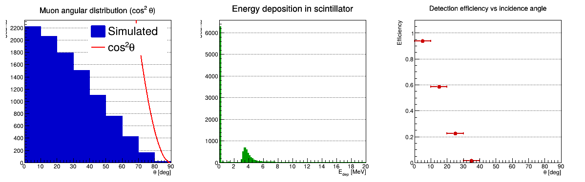
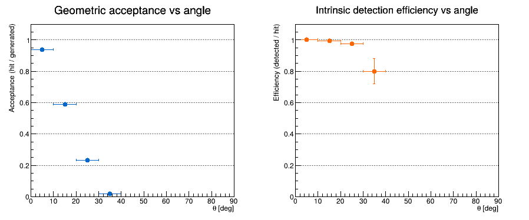
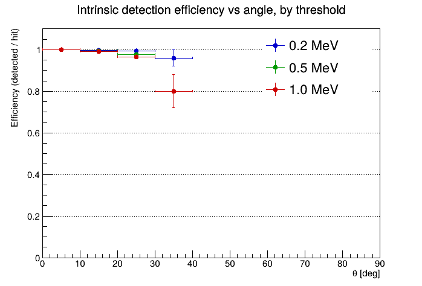
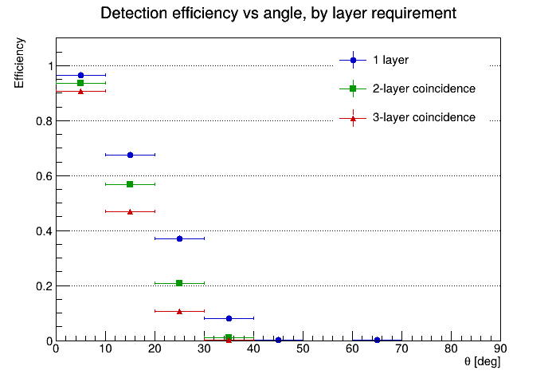

# Cosmic Muon Detector Simulation

A Geant4 simulation of cosmic muon detection in plastic scintillator, analyzed with ROOT. The core question is how detection efficiency depends on the muon's incidence angle, and what's actually driving that dependence — which turns out to be a mix of two very different effects that are easy to mix up if you're not careful: whether a muon geometrically reaches the detector at all, and whether it deposits enough energy to register once it's there.

There are two related setups in this repo. `single_layer/` is the main single-layer detector with the angular and threshold studies. `multilayer/` extends the geometry to three stacked layers to look at coincidence detection, which is how real cosmic-ray telescopes cut down on false triggers.

## Physics

Cosmic muons at sea level arrive with a zenith-angle distribution roughly proportional to cos²θ — mostly vertical, tailing off toward the horizon. A muon crossing a scintillator slab loses energy through ionization, and a detector calls it a "hit" if that deposit clears some threshold. Path length through a fixed-thickness slab scales with 1/cosθ, so off-axis muons should, if anything, deposit slightly more energy per crossing. That's the physics people usually think about first, and it's why the actual results below are a bit surprising.

## Setup

Single scintillator slab, 50×50×2 cm, `G4_PLASTIC_SC_VINYLTOLUENE`. Muons are 4 GeV mu⁻, generated from a 40×40 cm plane 80 cm above the detector, with θ sampled from cos²θ by rejection sampling. Physics list is QGSP_BERT. The multilayer version uses the same muon source but replaces the single slab with three identical slabs spaced 15 cm apart.

Each event records the true generated angle, the energy deposited (per layer, in the multilayer version), and whether the muon reached the detector geometrically at all (separate from whether it was "detected"). That last distinction ended up mattering a lot — see below.

## Running it

```bash
cd muonsim_phase2
mkdir build && cd build
cmake .. && make -j4

./muonSim 0.2
./muonSim 0.5
./muonSim 1.0

root -l ../analysis.C
root -l ../efficiency_breakdown.C
root -l ../compare_thresholds.C
```

`muonSim` takes the detection threshold in MeV as an optional argument (default 0.5), and writes a separate CSV per threshold so repeated runs don't clobber each other.

The multilayer version is the same idea, just `./muonSim 0.5` followed by `root -l ../layer_comparison.C`.

## What the angle actually determines

The first pass at this analysis showed detection efficiency collapsing hard with angle — high 90s% near vertical, down to single digits by 30-40°, essentially zero past that. That's a much steeper drop than the pure ionization physics would predict on its own, which was the first sign something else was going on.

Splitting the "detected" quantity into two pieces made it obvious: geometric acceptance (did the muon even reach the slab) and intrinsic efficiency (given that it did, was the energy deposit above threshold). Acceptance is the one doing almost all the work here — it falls from about 95% near vertical to a few percent by 30-40°, simply because the detector is small and only 80 cm below the source plane, so steep muons drift sideways past the edges before they ever get there. Intrinsic efficiency, on the other hand, stays close to 100% across almost the whole range for the 0.2 and 0.5 MeV thresholds. It only drops noticeably for the 1 MeV threshold, and mainly in the last angular bin, which also happens to be where statistics are thinnest since so few muons survive the acceptance cut to begin with.

So the honest summary is: this particular geometry is acceptance-limited, not physics-limited. A bigger slab or a taller gap between source and detector would push that acceptance curve out and let the actual threshold-dependent physics show up more cleanly across a wider angular range. Worth flagging as a real limitation rather than something to paper over — it's also a pretty natural thing to bring up if anyone asks about the results in an interview.

Efficiency curves use ROOT's binomial error option rather than plain Poisson errors, since detected and total aren't independent counts (detected is a subset of total), and treating them as independent understates the uncertainty.

## Multilayer / coincidence

The three-layer version compares three detection rules on the same simulated data: a hit in the top layer alone, a coincidence between the top two, and a coincidence across all three. As expected, requiring more layers to agree only ever costs efficiency — you can't gain by adding constraints — and the gap between the three curves widens with angle, since the layers are spread across 30 cm and a steeper muon is more likely to clip some layers but miss others. Near vertical the three curves aren't too far apart (roughly 97/94/91%), but by 10-20° they're already spreading out (67/57/47%), and all three collapse to zero past ~40° along with everything else, for the same acceptance reasons as above.

This is the standard trade-off real detectors deal with: coincidence logic rejects background and noise, at the cost of throwing away some real muons too, and that cost gets worse the more layers you require.

## A couple of bugs worth mentioning

Two things came up during development that are worth documenting, mostly because they're the kind of subtle Geant4 mistake that's easy to make twice.

The first version recorded the muon's angle inside the stepping action, only when it reached the scintillator. Muons that missed the detector never triggered that code, so their angle silently defaulted to zero, which meant every "miss" got miscounted as a near-vertical event instead of whatever steep angle it actually was. The fix was to record the angle at generation time instead, in the primary generator, so it's always correct regardless of whether the muon goes on to hit anything.

That introduced a second, sneakier bug: Geant4 generates each event's primaries *before* calling `BeginOfEventAction`, and the event action was resetting the angle to zero right there — wiping out the value that had just been set moments earlier, before it was ever used. Took a second look at the actual Geant4 event ordering to catch that one. Fixed by not resetting the angle in `BeginOfEventAction`, since it's always set fresh by the generator before it's read.

## Files

```
muonsim_phase2/
├── main.cc                     # threshold passed as CLI arg, e.g. ./muonSim 0.5
├── DetectorConstruction.cc/hh  # single scintillator slab
├── PrimaryGeneratorAction.cc/hh  # cos²θ muon source, records true angle
├── EventAction.cc/hh           # per-event CSV output
├── SteppingAction.cc/hh        # energy deposit + hit flag
├── analysis.C                  # angular distribution, edep spectrum, overall efficiency
├── efficiency_breakdown.C      # acceptance vs intrinsic efficiency
├── compare_thresholds.C        # intrinsic efficiency across three thresholds
└── CMakeLists.txt

muonsim_multilayer/
├── DetectorConstruction.cc/hh  # three stacked slabs, 15 cm apart
├── EventAction.cc/hh           # per-layer edep and detection flags
├── layer_comparison.C          # 1-layer vs 2-layer vs 3-layer coincidence
└── (same main/generator/stepping structure as above)
```

## Results

Angular distribution vs the cos²θ expectation, energy deposit spectrum, and overall efficiency vs angle:



Acceptance vs angle and intrinsic efficiency vs angle, split apart:



Intrinsic efficiency at three thresholds:



Efficiency for 1-layer / 2-layer coincidence / 3-layer coincidence:



## If I kept going

The most useful next step would be enlarging the detector or increasing the source-to-detector distance, since that's the main thing currently limiting the angular range where the interesting physics (threshold effects, energy loss vs angle) is actually visible above the geometric acceptance cutoff. Running more than 10,000 events per configuration would also help — the high-angle bins are thin enough right now that their error bars are doing a lot of the talking. Writing output straight to a ROOT TTree instead of a CSV intermediate would be a nice cleanup but isn't really adding new physics, so it's lower priority than the geometry change.
